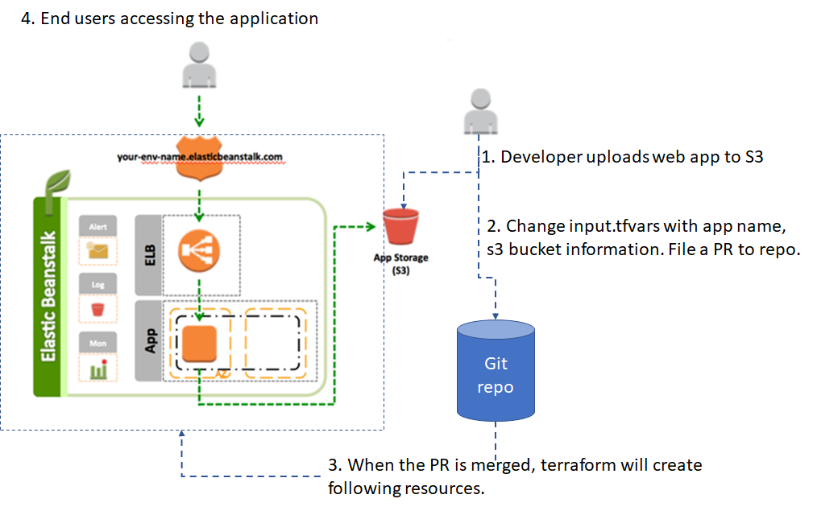

# Deploying a web application on elastic beanstalk using terraform

AWS Elastic Beanstalk is an easy-to-use service for deploying and scaling web applications and Docker containers on familiar servers such as Apache, Nginx, Passenger, and IIS.

It allows to upload application code and handles the deployment, from capacity provisioning, load balancing, auto-scaling and also monitors application health. 

Elastic Beanstalk is free to use and cost is incurred only for the AWS resources needed to store and run applications.

This project shows how infrastructure as code tools like terraform can be used to automatically provision elastic bean stalk application and manage a web application. Overview of deployment architecture is shown below:

1. Developer uploads a java web app to S3

2. Change input.tfvars with app name, environment name and s3 bucket information related to step 1. Next, file a PR to this repo.

3. Once the PR is merged, terraform will create necessary resources.

4. Visit aws elastic beanstalk console to get url to access the application

5. To delete the created resources change line 6 in [.travis.yml](.travis.yml) file with DESTROY=true and file a PR. Once the PR is merged terraform will destroy resources.

6. To create different environments extend the main.tf file with new modules for staging, production.

